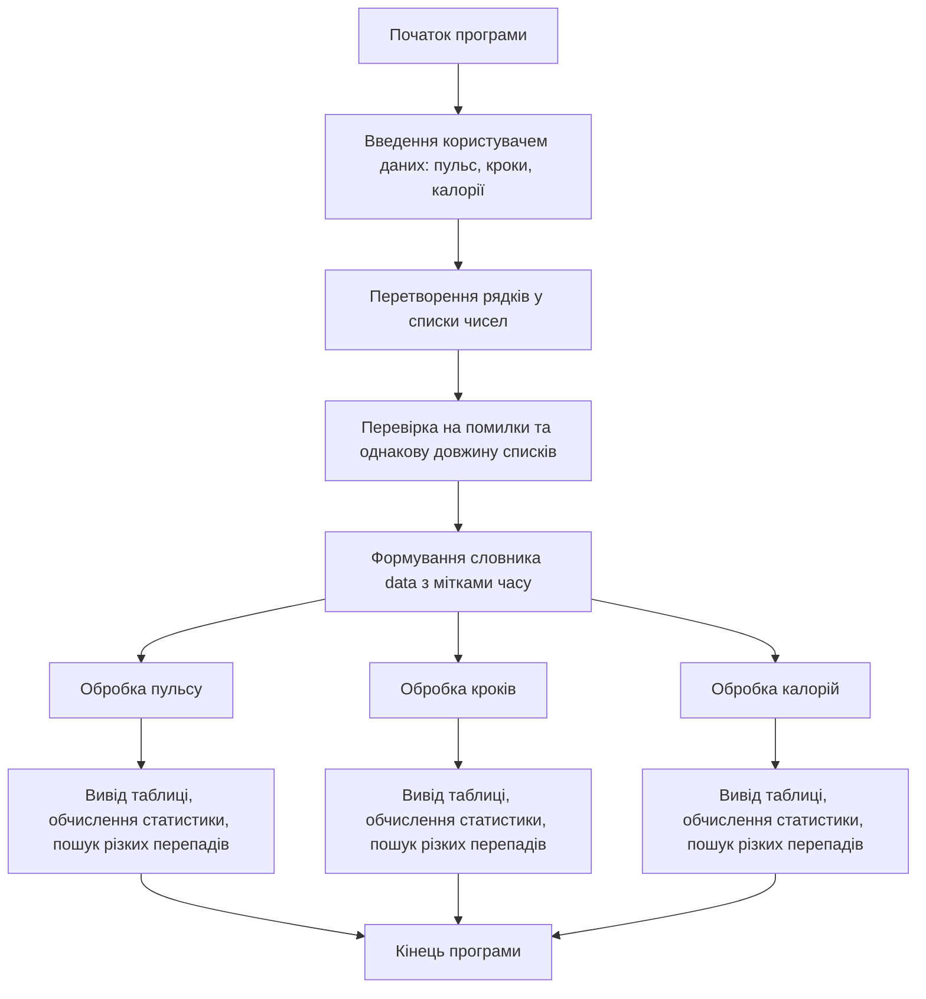
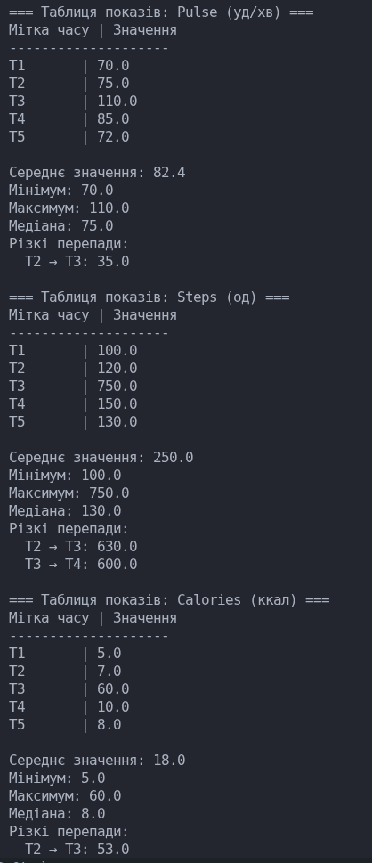

# Звіт по лабораторній роботі №2

**Тема:** Процедурна парадигма. Використання підпрограм, модулів та пакетів у Python  
**Варіант:** 5 — Фітнес-браслет

---

## 1. Опис завдання

Мета роботи — ознайомитися зі способами створення та використання підпрограм, модулів і пакетів у Python, структурувати програму на функціональні частини та модулі, закріпити навички застосування стандартних модулів Python.

**Завдання для варіанту 5 (Фітнес-браслет):**

- Показники: пульс (уд/хв), кроки (од), калорії (ккал)
- Порогові значення для різких перепадів:
  - пульс: >30 уд/хв
  - кроки: >500 од
  - калорії: >50 ккал

Програма повинна:

1. Приймати від користувача рядки даних для кожного показника.
2. Формувати словник даних з мітками часу (`T1`, `T2`, …).
3. Використовувати власний модуль `stats_module.py` для обчислення статистичних характеристик: середнє, мінімум, максимум, медіана.
4. Виявляти різкі перепади значень, що перевищують порогові значення.
5. Виводити таблиці та результати обчислень на екран.

---

## 2. Алгоритми програм

### 2.1 Основний алгоритм програми (`lab02_main.py`)

### 2.2 Алгоритм модуля (`stats_module.py`)

flowchart TD
A[Функції модуля] --> B[get_average] --> C[Обчислення середнього значення списку]
A --> D[get_min] --> E[Повертає мінімальне значення]
A --> F[get_max] --> G[Повертає максимальне значення]
A --> H[get_median] --> I[Обчислення медіани]
A --> J[find_jumps] --> K[Виявлення різких перепадів > threshold]
A --> L[show_table] --> M[Вивід таблиці значень з мітками часу]

## 3. Початкові дані та результати виконання

Пульс (уд/хв): 70 75 110 85 72 \n
Кроки (од): 100 120 750 150 130 \n
Калорії (ккал): 5 7 60 10 8 \n

### Результати виконання:

## 4. Висновки

Програма реалізована у процедурному стилі з розділенням на модуль (stats_module.py) та основну програму (lab02_main.py).
Модуль включає функції для обчислення основних статистичних характеристик та пошуку різких перепадів.
Програма перевіряє коректність введених даних та однакову довжину списків.
Використання словників зі мітками часу забезпечує структуроване збереження даних.
Переваги:
Простота розширення програми (додавання нових показників).
Зручність повторного використання модуля в інших проєктах.
Недоліки:
Програма передбачає однакову кількість показників у всіх рядках.
Обробка дуже великих обсягів даних потребує оптимізації.
